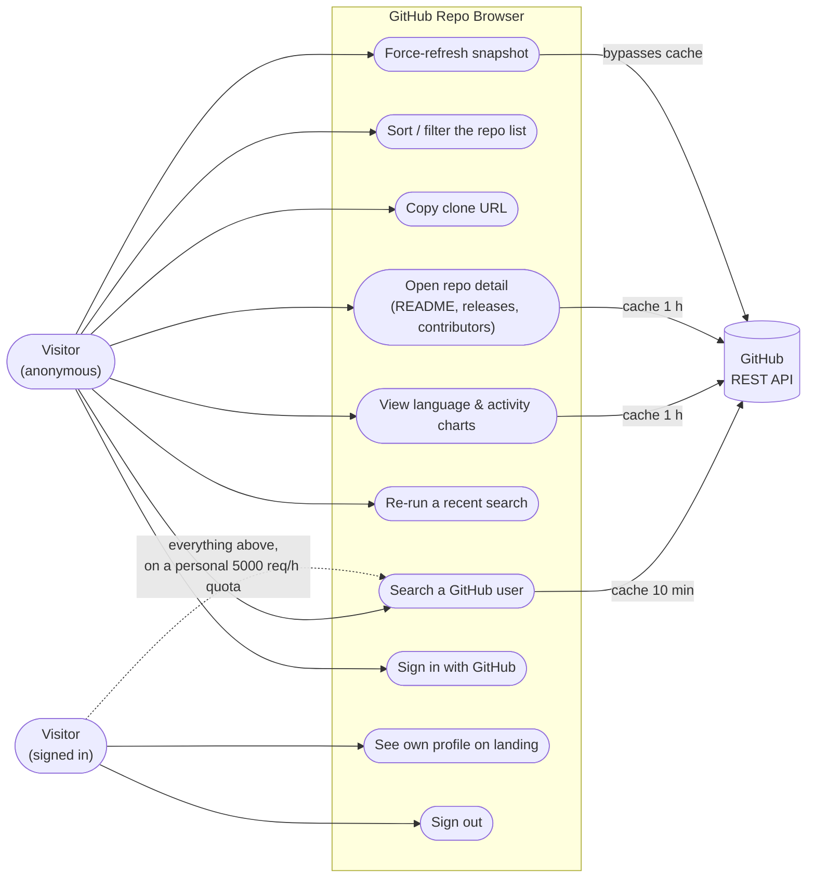

# GitHub Repo Browser

Search any GitHub user and browse their public repositories with sorting, filtering, snapshot caching, and recent-search history.

Two-part app:

- **`backend/`** — Spring Boot 3.5 (Java 21) REST API. Proxies the GitHub REST API (version `2026-03-10`), caches each user snapshot in an H2 file database for 10 minutes, and records search history.
- **`frontend/`** — React 19 + Vite SPA. Search form, profile card, repo list with sort/filter options, copy-clone-URL, and recent searches. All filtering happens client-side.

## Prerequisites

| Tool | Version | Install (macOS) |
|------|---------|-----------------|
| Java | 21 | `brew install openjdk@21` |
| Maven | 3.9+ | `brew install maven` |
| Node | 20+ | `brew install node` |

> This machine's system Java is 1.8 — always point `JAVA_HOME` at the Homebrew JDK 21 when running Maven (shown below).

Optional: a GitHub personal access token raises the API rate limit from 60 to 5,000 requests/hour (no scopes needed for public data):

```bash
cp .env.example .env       # fill in GITHUB_TOKEN
export GITHUB_TOKEN=ghp_xxx
```

## Running the app

Two terminals:

```bash
# Terminal 1 — backend API on http://localhost:8080
cd backend
JAVA_HOME=/opt/homebrew/opt/openjdk@21 mvn spring-boot:run
```

```bash
# Terminal 2 — frontend on http://localhost:5173
cd frontend
npm install        # first time only
npm run dev
```

Open **http://localhost:5173** and search a username (try `octocat`).

The Vite dev server proxies `/api` requests to the backend, so no CORS setup is needed. The H2 database file is created automatically at `backend/data/` on first run.

## Features

- **Profile card** — avatar, name, bio, followers, public repo count, total stars
- **Repo list** — name, description, language, stars, forks, last update, fork/archived badges
- **Sort** by stars, forks, name, or last updated · **filter** by language · **hide** forks/archived, with a live "X of Y repositories" count
- **Copy clone URL** in one click, with confirmation
- **Snapshot cache** — repeat searches within 10 minutes are served from the database (zero GitHub quota); a "cached" badge shows fetch time and a **Refresh** button forces live data
- **Recent searches** — last 10 users as one-click chips on the landing page
- **Language chart** — donut of language share across the user's top 25 non-fork repos
- **Activity chart** — 52-week commit totals across the top 10 repos, with a "still computing" state while GitHub prepares statistics
- **Repo detail panel** — click "Details" on any repo: rendered README, latest releases, top contributors, per-repo language bar (cached 1h)
- **Sign in with GitHub** — optional OAuth2 login; signed-in visitors browse under their own 5,000 req/h quota
- **Friendly errors** — unknown user, invalid username, rate limit (with retry timing), GitHub down

## Use cases



Anonymous visitors share one upstream quota (60 req/h, or 5,000 with `GITHUB_TOKEN`); signing in switches all GitHub calls to the visitor's personal quota. Sorting, filtering and copy actions never touch the network.

## API

| Endpoint | Description |
|----------|-------------|
| `GET /api/users/{username}` | Profile + up to 300 repos. `?refresh=true` bypasses the cache. |
| `GET /api/searches/recent` | Last 10 searched usernames, deduplicated, newest first. |
| `GET /api/users/{username}/languages` | Language share across top 25 non-fork repos (cached 1h). |
| `GET /api/users/{username}/activity` | 52 weekly commit totals across top 10 repos; `pending: true` while GitHub computes. |
| `GET /api/repos/{owner}/{repo}` | README, last 5 releases, top 10 contributors, languages (cached 1h). |
| `GET /api/me` | Logged-in visitor identity, or `authenticated: false`. |

Errors follow RFC 7807 (`application/problem+json`): `400` invalid username, `404` unknown user, `429` rate-limited (includes `retryAfterSeconds`), `502` GitHub unreachable. Full contract: [specs/001-github-repo-browser/contracts/api.yaml](specs/001-github-repo-browser/contracts/api.yaml).

Quick smoke test with the backend running:

```bash
curl -s localhost:8080/api/users/octocat | head -c 300
curl -s -i localhost:8080/api/users/no-such-user-xyz-00000 | head -1   # 404
```

## Tests

```bash
# Backend — 88 tests (client parsing/pagination, cache TTL, error mapping, controllers)
cd backend && JAVA_HOME=/opt/homebrew/opt/openjdk@21 mvn test

# Frontend — 47 tests (sort/filter functions, API client, username validation)
cd frontend && npm test
```

## Project structure

```
backend/
  src/main/java/dev/luigivivian/githubtool/   # Spring layered layout
    config/      # app properties, CORS
    controller/  # REST controllers
    service/     # SnapshotService (cache TTL logic)
    repository/  # Spring Data interfaces
    entity/      # JPA entities (Snapshot, SearchRecord)
    dto/         # API response records
    client/      # GithubClient (RestClient) + upstream DTOs
    exception/   # domain exceptions + problem+json handler
frontend/
  src/
    api/         # typed fetch client
    lib/         # repoView.ts — pure sort/filter functions
    components/  # SearchForm, ProfileCard, RepoFilters, RepoRow, RecentSearches, ErrorBanner
specs/001-github-repo-browser/   # spec, plan, research, data model, OpenAPI contract, quickstart
```

## Configuration

| Setting | Default | Where |
|---------|---------|-------|
| `GITHUB_TOKEN` | empty (anonymous, 60 req/h) | environment variable |
| `GITHUB_CLIENT_ID` / `GITHUB_CLIENT_SECRET` | empty (sign-in disabled) | environment variables (see `.env.example`) |
| Snapshot cache TTL | `10m` | `app.github.cache-ttl` in `backend/src/main/resources/application.yml` |
| Insights cache TTL | `1h` | `app.insights.ttl` |
| Repo cap | 300 (most recently updated) | `GithubClient` (3 pages × 100) |
| Insights caps | 25 repos (languages) · 10 (activity) · 5 releases · 10 contributors | `InsightsService` / `RepoDetailService` |
| Ports | API 8080 · SPA 5173 | `application.yml` / Vite default |

## Troubleshooting

- **`mvn` fails with class version errors** — `JAVA_HOME` is not set to JDK 21. Prefix the command as shown above.
- **429 rate limit after a few searches** — anonymous GitHub quota is 60 req/h, and one uncached profile view with charts costs up to ~35 upstream calls (25 languages + 10 activity). Anonymous mode works for a quick demo; for real use set `GITHUB_TOKEN` (5,000 req/h) or sign in.
- **Stale data** — snapshots live for 10 minutes; click **Refresh** on the profile card to force a live fetch.
- **Reset local data** — stop the backend and delete `backend/data/`.

More context: [CLAUDE.md](CLAUDE.md) (architecture + conventions) · [DEVLOG.md](DEVLOG.md) (decisions, lessons) · [quickstart.md](specs/001-github-repo-browser/quickstart.md) (validation scenarios).
